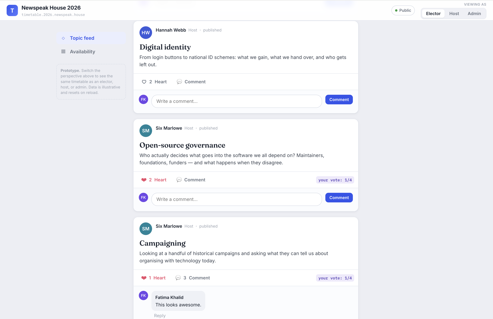
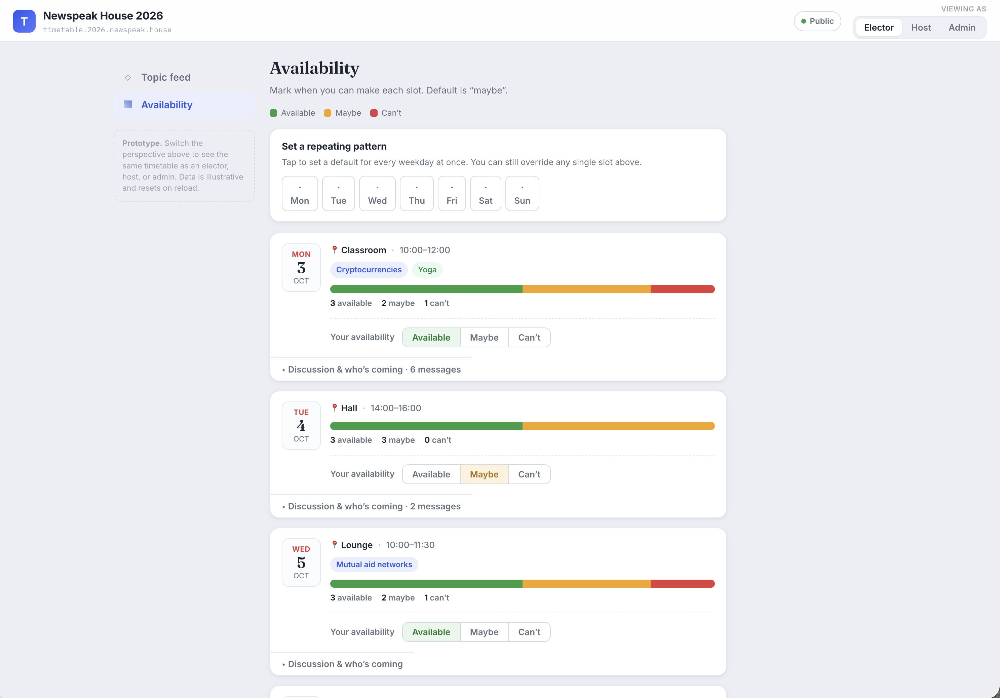

# Timetable

Collaborative timetables for proposing topics, voting with hearts, sharing
availability, and shaping a schedule together.

A [Newspeak House](https://www.newspeak.house/) x
[Sparkle Bureaucracy](https://www.sparklebureaucracy.org/) production.





## What It Does

Timetable is a multi-tenant web app. Each timetable is its own workspace with
members, roles, topics, comments, hearts, availability slots, moderation, and
dashboard analytics.

Core workflows:

- Hosts propose and submit topics.
- Admins moderate topics, manage members, create slots, and tag topics to slots.
- Electors heart topics, comment, and mark availability.
- Hosts and admins use weighted-heart scores, elector activity filters,
  availability breakdowns, and conflict alerts to plan the final schedule.
- Users can subscribe to a timetable's slots through an ICS calendar feed.

## Quick Start

Prerequisites:

- Node.js 20 or newer
- Docker, or another PostgreSQL 16 instance
- Clerk application keys for authentication

```bash
npm install

cp .env.example .env
cp .env.example apps/web/.env.local

npm run db:up
npm run db:migrate
npm run db:seed
npm run dev
```

Local URLs:

- Web: `http://localhost:3000`
- API: `http://localhost:4000`
- GraphQL: `http://localhost:4000/graphql`

For Clerk development instances, test emails using `+clerk_test` can sign in
with OTP code `424242`.

The seed command reads `dev-sample-data.md` and replaces only the sample
timetable with slug `spt-test-data`. It creates deterministic local dev users,
including owner `dev_sample_admin-edwin`
(`admin-edwin@sample.timetable.test`), without calling Clerk.

Hosted dev can run the same seed as an optional manual `Deploy Dev` workflow
task; production deploys never run it.

## Docs

Detailed project docs are tracked in this repository so they can be reviewed in
pull requests with code changes.

- [Product](docs/PRODUCT.md): roles, workflows, privacy, notifications, and sync.
- [Architecture](docs/ARCHITECTURE.md): apps, packages, API surfaces, auth flow,
  data model, and runtime boundaries.
- [Deployment](docs/DEPLOYMENT.md): local/dev/prod environments, Clerk,
  DigitalOcean, GitHub Actions, secrets, and cron.
- [Roadmap](docs/ROADMAP.md): current status, known gaps, testing risks, and
  next recommended work.

Static README screenshots live in [docs/assets/readme](docs/assets/readme).
The web app logo lives in [apps/web/public/assets](apps/web/public/assets).

## Scripts

| Command | Description |
| --- | --- |
| `npm run dev` | Run API and web together |
| `npm run dev:api` / `npm run dev:web` | Run one app |
| `npm run typecheck` | Type-check every workspace |
| `npm run test` | Run unit tests |
| `npm run lint` | Lint the web app |
| `npm run build` | Build all workspaces |
| `npm run db:generate` | Generate a SQL migration from the schema |
| `npm run db:migrate` | Apply migrations |
| `npm run db:seed` | Seed the local dev database from `dev-sample-data.md` |
| `npm run db:studio` | Open Drizzle Studio |
| `npm run db:up` / `npm run db:down` | Start or stop local Postgres |

## Status

Phases 0-3 are substantially implemented. Phase 4 is partial, but the tracked
app now includes:

- dashboard analytics with host-scoped elector activity filters
- conflict alerts, topic-to-slot tagging, and ICS calendar export
- digest computation, a protected digest job endpoint, scheduled GitHub Actions
  caller, and Resend environment plumbing
- custom-domain routing hooks and separate DigitalOcean dev/prod app specs
- API hardening with GraphQL depth/cost limits, structured request/error
  logging, and database-backed hosted rate limiting

Remaining major gaps include verified production email delivery, multi-channel
notifications, object-storage-backed media uploads, production DNS/Clerk
verification, traffic-based tuning, and broader permission/integration/browser
test coverage.

See [Roadmap](docs/ROADMAP.md) for the full status and risk list.
