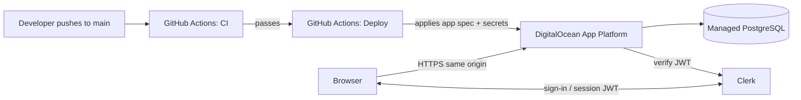
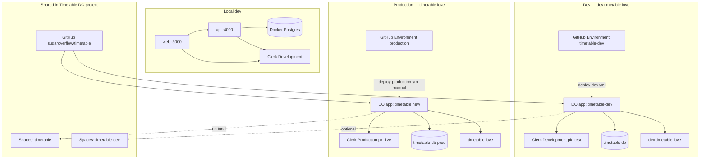

# Timetable

Collaborative timetables — a multi-tenant web app for proposing topics, voting
with hearts, sharing availability, and moderating a schedule.

A [Newspeak House](https://www.newspeak.house/) x [Sparkle Bureaucracy](https://www.sparklebureaucracy.org/) production.


## Contents

- [What it does](#what-it-does)
- [Current status & phase checklist](#current-status--phase-checklist)
- [Architecture](#architecture)
- [Assets](#assets)
- [How production works](#how-production-works)
- [Environments (local, dev, production)](#environments-local-dev-production)
- [Getting started (local dev)](#getting-started-local-dev)
- [Environment variables](#environment-variables)
- [Scripts](#scripts)
- [Deployment (Clerk + DigitalOcean)](#deployment-clerk--digitalocean)
- [Roadmap & known limitations](#roadmap--known-limitations)

---

## What it does

A **timetable** is an independent workspace (tenant) with its own members,
topics, and schedule. One person can belong to many timetables and hold
different roles in each.

**Roles** (scoped per timetable, stored on the membership):

| Role | Can |
| --- | --- |
| Owner | Everything an admin can, plus is the protected owner of the timetable |
| Admin | Moderate topics, hide comments, manage members/roles, edit settings, create timeslots, tag topics to slots, view the dashboard |
| Host | Propose topics (draft → submit), see weighted-heart breakdowns and host-only threads, join slot discussions, view the dashboard |
| Elector | Read published topics, heart and comment on them, set availability |

**Topic feed.** Hosts draft topics (markdown), submit them for moderation, and
admins publish / request changes / reject. Electors heart and comment
(threaded; public + host-only visibility). Hearts are **weighted**: each elector
spreads a total influence of 1 across the topics they heart
(`weight = 1 / number of published topics they hearted`), so hearting fewer
topics counts for more. Hosts/admins see the weighted score and per-elector
breakdown; electors do not.

**Availability calendar.** Admins create timeslots (single or weekly-repeating).
Electors mark availability per slot (🔴/🟡/🟢, default 🟡) or apply a weekday
pattern in bulk. Hosts/admins see aggregate counts and a per-elector breakdown,
filtered by audience (all electors / electors who hearted my topics / electors
who hearted a specific topic). Slots have host/admin discussion threads and can
be tagged with topics; tagging two topics to one slot raises a **conflict**
alert.

**Moderation & admin.** A moderation queue, an append-only activity log,
member/role management, invites by email, timetable profile + visibility
(`public` / `private` / `deactivated`), custom role labels, theme colours, and a
**dashboard** (topic-status counts, weighted topic & host leaderboards,
unallocated published topics, slot conflicts).

**Privacy.** `public` timetables are readable by anonymous visitors (feed +
public comments; hearting/posting still require sign-in); `private` is
members-only; `deactivated` is admins-only. Enforced server-side.

**Notifications & sync.** Opt-in daily email digests (new topics, replies to
your comments, activity on your topics) and an ICS calendar feed you can
subscribe to from any calendar app.

---

## Current status & phase checklist

Progress is tracked against the backend implementation plan in
[`.cursor/plans/timetable_backend_plan_5ea00e75.plan.md`](.cursor/plans/timetable_backend_plan_5ea00e75.plan.md).
Status below reflects the **current codebase**, not only the plan file’s todo
metadata (which still marks Phase 4 as pending).

| Phase | Plan status | Summary |
| --- | --- | --- |
| Phase 0 — Foundation | **Done** | Monorepo, Drizzle + migrations, Clerk auth, timetable/membership/invite REST + core GraphQL, timetable switcher, `.do/app.yaml`, CI. Original plan used Auth.js magic links; the repo migrated wholesale to Clerk. |
| Phase 1 — Topic Feed MVP | **Done** | Topics/hearts/comments/activity log, moderation workflow, weighted hearts, markdown rendering, feed + host/moderation/activity UI. Optional REST extras (bulk invite resend, activity CSV export) not built. |
| Phase 2 — Profiles, privacy & polish | **Mostly done** | Clerk SSO, profiles, privacy enforcement, comment hide, admin unpublish, archive hearts, host filter on feed, digest prefs (stored). **Partial:** Spaces upload code wired but needs `SPACES_*`; custom role labels + theme colors saved but not rendered; cursor/infinite scroll not built; feed “comments” sort uses comment counts, not latest-comment SQL. |
| Phase 3 — Availability calendar | **Done** | Timeslot CRUD + weekly repeat, availability + weekday patterns, audience filters, slot discussion, topic tagging. ICS export built (plan originally deferred this). |
| Phase 4 — Notifications, domains, analytics | **Partial** | Dashboard analytics and slot-conflict alerts done; daily digest compute/send + cron REST endpoint done (needs Resend + scheduled caller). **Not started:** Novu / WhatsApp / Matrix / webhooks; calendar sync provider; hostname → timetable routing for custom domains. |

### Phase 0 — Foundation

| Item | Status | Notes |
| --- | --- | --- |
| Monorepo (`apps/web`, `apps/api`, `packages/db`, `packages/core`, `packages/shared`) | Done | npm workspaces |
| Drizzle schema + migrations | Done | `packages/db/drizzle` 0000–0005 |
| Auth (Clerk; plan originally Auth.js magic link) | Done | `@clerk/nextjs` + `@clerk/backend`; local `user` row keyed by Clerk id |
| Core tables: users, timetables, memberships, invites | Done | |
| REST: create timetable, invite emails, patch member roles | Done | `apps/api/src/rest/router.ts` |
| GraphQL: `me`, `myTimetables`, `timetable`, membership reads | Done | |
| Next.js: sign-in/up, timetable switcher, role-aware nav | Done | |
| DigitalOcean deploy spec + CI | Done | `.do/app.yaml`, `.github/workflows/ci.yml` |
| Exit criteria (create/switch timetables, invite, role-scoped nav) | Done | Ready to verify manually |

### Phase 1 — Topic Feed MVP

| Item | Status | Notes |
| --- | --- | --- |
| Entities: topics, hearts, comments, activity_events | Done | |
| Topic lifecycle (draft → submit → publish/unpublish, request changes) | Done | |
| GraphQL feed, host dashboard, moderation queue, activity timeline | Done | No cursor pagination yet |
| Mutations: heart, comment/reply, moderate, hide comment | Done | |
| Weighted hearts (server-side) | Done | `packages/shared/src/hearts.ts` + `buildFeed` |
| Markdown render + sanitize | Done | API-side |
| Image upload to Spaces for topic covers | Partial | `POST /api/uploads` + `ImageUpload` component; returns 503 without `SPACES_*` |
| REST bulk invite resend / activity CSV export | Not started | Marked optional in plan |
| Frontend: feed, host topics, moderation, settings (role matrix/labels/theme) | Done | Settings persist; labels/theme not applied in UI (see Phase 2) |

### Phase 2 — Profiles, privacy & polish

| Item | Status | Notes |
| --- | --- | --- |
| Clerk SSO (Google/Microsoft via dashboard) | Done | Replaced Auth.js entirely |
| User profile (name, avatar, bio) | Done | `/profile` + `updateMyProfile` |
| Timetable profile (name, description, cover, visibility, custom domain field) | Done | `/t/[slug]/settings` |
| Privacy modes enforced server-side | Done | `canReadTimetable` in `@timetable/shared` |
| Comment hide/unhide, admin unpublish, archive hearts | Done | |
| Host filter on feed | Done | By host, not by elector activity |
| Digest preference storage | Done | No sends until Phase 4 job runs |
| Spaces uploads (avatars, covers) | Partial | Backend + UI wired; bucket/credentials required |
| Custom role labels + theme colors rendered in UI | Partial | Saved via `updateTimetableSettings`; `RolePills`/nav still use hardcoded labels/CSS |
| Cursor infinite scroll + `recent`-sort pagination | Not started | Decided approach documented in plan |
| Host dashboard filter by elector activity | Not started | Calendar audience filters cover the elector case in Phase 3 |

### Phase 3 — Availability calendar

| Item | Status | Notes |
| --- | --- | --- |
| Entities: timeslots, availability, slot_comments, slot_topics | Done | Migration 0004 |
| Admin slot CRUD + weekly repeat | Done | |
| Elector availability + weekday bulk pattern | Done | |
| Audience filters (all / hearted mine / hearted topic) | Done | Calendar page |
| Slot discussion (host/admin) | Done | |
| Admin slot–topic tagging | Done | |
| ICS export | Done | `GET /api/timetables/:idOrSlug/calendar.ics` + `myIcsToken` |
| Calendar sync provider (Nylas/Cronofy) | Not started | Plan deferred evaluation |

### Phase 4 — Notifications, domains & analytics

| Item | Status | Notes |
| --- | --- | --- |
| Dashboard analytics | Done | `dashboard` GraphQL query + `/t/[slug]/dashboard` |
| Multi-topic slot conflict alerts | Done | Shown on dashboard |
| Daily digest job (new topics, replies, host activity) | Partial | `computeUserDigest`, `POST /api/jobs/digests`, Resend/console fallback; needs `CRON_SECRET`, `RESEND_API_KEY`, and an external scheduler |
| Custom domain per timetable | Partial | Field + `timetableByDomain` query; no Next.js middleware to route by hostname |
| Novu / WhatsApp / Matrix / webhooks | Not started | |
| Inngest / BullMQ job queue | Not started | Plan suggested; current impl uses a single cron REST endpoint |
| Production hardening (plan audit P0) | Not started | No GraphQL depth/cost limits, rate limiting, env validation, or mutation privacy re-check on deactivated timetables |

**Housekeeping from the plan:** the overview page at `/t/[slug]` still shows stale
copy (“feed/calendar/moderation arrive in Phase 1”) even though those routes exist.

### Ready for first testing when

- `npm install` has completed and the local or managed Postgres database is up.
- Root `.env` is configured for the API/DB tooling and `apps/web/.env.local` is
  configured for Next.js.
- Clerk dev or live keys are present in the right env files and the Clerk app
  allows the local/production origins.
- Migrations have been applied with `npm run db:migrate`.
- Optional services are either configured or accepted as disabled: `SPACES_*`
  for uploads, `RESEND_API_KEY`/`EMAIL_FROM` plus `CRON_SECRET` for digests.
- A smoke test creates a timetable, assigns/invites roles, submits/publishes a
  topic, hearts/comments on it, creates slots, marks availability, and opens the
  dashboard/ICS feed.

### Known gaps before wider testing

These align with the plan’s **P0 hardening** and **Phase 4** remaining work:

- **No integrated/E2E test pass yet.** Only weighted-heart unit tests exist;
  the plan’s per-role GraphQL integration tests and Playwright E2E are not built.
- **P0 security/ops (plan audit H1–H4):** no GraphQL depth/cost limits, API rate
  limiting, zod env validation with fail-fast startup, or privacy re-check on
  mutations when a timetable is `deactivated`.
- **Phase 2 UI parity gaps:** custom role labels and theme colors are stored but
  not rendered; cursor/infinite scroll for the feed is not implemented.
- **Phase 4 deployment gaps:** digest sending needs a scheduled caller hitting
  `POST /api/jobs/digests`; custom domains need DNS **and** web hostname routing;
  Novu/multi-channel notifications are not started.
- **Spaces uploads:** code is wired, but without `SPACES_*` the upload endpoint
  returns 503; externally hosted image URLs still work.
- **DigitalOcean provisioning:** `.do/app.yaml` exists, but the repo alone does
  not prove App Platform, Managed PostgreSQL, Clerk production origins, Spaces,
  Resend, or cron have been provisioned.

---

## Architecture

A single npm-workspaces monorepo:

```
apps/
  web/    Next.js 16 (App Router) — UI, Clerk auth, server actions
  api/    Express + GraphQL Yoga (Pothos) — GraphQL for the UI, REST for admin/jobs
packages/
  db/     Drizzle ORM schema, client, SQL migrations
  core/   Domain/service layer — shared by web + api (the only place with business logic)
  shared/ Pure logic: roles, permissions, weighted-heart math, zod validation
```

The important boundary is that `apps/web` should stay a UI/client for API calls,
while `packages/core` owns timetable business operations and `packages/shared`
owns pure validation/authorization helpers. Both GraphQL and REST call into the
same core services, so behavior should not fork between API surfaces.

### Stack

| Concern | Choice |
| --- | --- |
| Web | Next.js 16 App Router, React 19 |
| Auth | Clerk (`@clerk/nextjs` on web, `@clerk/backend` on the API) |
| API | Express + GraphQL Yoga with Pothos (code-first schema) |
| Database | PostgreSQL 16 + Drizzle ORM / drizzle-kit migrations |
| Markdown | markdown-it + sanitize-html (rendered server-side) |
| Email | Resend (digests); logs to console in dev |
| Hosting | DigitalOcean App Platform + Managed PostgreSQL (+ Spaces for uploads) |
| Tooling | TypeScript, ESLint, Vitest, Docker (local Postgres) |

### Apps and packages

- `apps/web` is a Next.js App Router app. It renders the signed-in app shell,
  Clerk sign-in/up pages, timetable list, topic feed, host dashboard, moderation,
  activity, settings, profile, and availability calendar. Server components call
  GraphQL through `apps/web/src/lib/graphql.ts`; client components call REST or
  upload endpoints through `apps/web/src/lib/clientApi.ts`.
- `apps/api` is an Express service. It mounts GraphQL Yoga at `/graphql`, REST
  routes under `/api`, health checks at `/health`, Clerk token verification, email
  rendering/sending, ICS generation, markdown rendering, and Spaces uploads.
- `packages/db` defines the Drizzle schema, client, and SQL migrations.
- `packages/core` implements timetable, member, invite, topic, heart, comment,
  profile, setting, calendar, analytics, digest, and activity-log operations.
- `packages/shared` contains roles/permissions, zod input schemas, slug helpers,
  and weighted-heart math. It is the only package with unit tests today.

### API surface

- **GraphQL** at `/graphql` powers the UI with role-aware reads and most
  mutations: `me`, `myTimetables`, `timetable`, `topicFeed`, `hostDashboard`,
  `moderationQueue`, `activityTimeline`, `calendar`, `dashboard`,
  `timetableMembers`, `myIcsToken`, `timetableByDomain`, plus mutations for
  topics (`createTopic`/`submitTopic`/`moderateTopic`/…), `heartTopic`,
  comments, availability (`setAvailability`/`setWeekdayAvailability`), slots,
  profiles, and settings.
- **REST** under `/api/*` handles timetable lifecycle, integrations, and jobs:
  - `POST /api/timetables` — create a timetable (creator becomes owner+admin)
  - `POST /api/timetables/:id/invites` — invite emails / assign roles
  - `PATCH /api/memberships/:id/roles` — change a member's roles
  - `POST /api/uploads?kind=avatar|topic-cover|timetable-cover` — authenticated
    image upload (raw file body); stores it in Spaces and returns its public URL
  - `POST /api/jobs/digests` — cron-triggered digest send (header `x-cron-secret`)
  - `GET /api/timetables/:idOrSlug/calendar.ics` — ICS feed (public, or
    `?token=<user.icsToken>` for private)
  - `GET /health`

Both layers call the same `@timetable/core` services and enforce authorization
via `@timetable/shared`.

### Main flows

- **Auth and membership:** Clerk owns sessions and identity. The API verifies a
  Bearer token, upserts a local user row keyed by Clerk user id, and claims any
  pending email invites. Timetable roles are stored per membership, not globally
  on the user.
- **Admin setup:** a signed-in user creates a timetable through REST and becomes
  owner/admin. Admins invite emails, assign roles, update profile/visibility,
  role labels, theme colors, cover image URL, and member roles.
- **Topics and moderation:** hosts create drafts, edit them, and submit for
  moderation. Admins publish, reject, request changes, unpublish, archive hearts,
  and hide comments. Published topics appear in the feed.
- **Hearts and comments:** electors can heart published topics. Weighted scores
  are computed as `1 / number of published topics hearted by that elector`;
  host/admin views can see weighted totals and per-elector breakdowns. Members
  can post public comments; hosts/admins can use host-only threads.
- **Profiles and images:** users can edit name, bio, and avatar URL. The upload
  component sends raw image bodies to `POST /api/uploads`, which stores PNG/JPEG/
  WebP/GIF files in DigitalOcean Spaces when configured.
- **Calendar:** admins create one-off or weekly timeslots. Electors set red,
  yellow, or green availability per slot or by weekday. Hosts/admins can filter
  availability audiences, discuss slots, tag topics to slots, and see conflicts
  where one slot has multiple topic tags.
- **Notifications and sync:** users opt into digest sections. A cron caller hits
  `POST /api/jobs/digests` with `x-cron-secret`; without Resend configured, dev
  email sending falls back to console logging. Calendar slots are exposed as ICS
  through REST, with a per-user token for private timetables.

### Authentication flow

Clerk owns identity; the database keeps a local `user` row whose **id is the
Clerk user id**, created on first sign-in (so domain tables can hold foreign
keys without calling Clerk).

- Web **server** code calls the API with `Authorization: Bearer <token>` from
  Clerk's `auth().getToken()`.
- Web **client** components use the token from `window.Clerk.session.getToken()`.
- The API verifies the token with `verifyToken` (networkless JWKS) and upserts
  the local user; pending email invites are claimed on first sign-in and when
  the user opens their timetable list.

There are no Auth.js tables and no webhook is required for normal operation.

### Data model

`users`, `timetables`, `timetable_memberships`, `timetable_invites`, `topics`,
`hearts`, `comments`, `activity_events`, `timeslots`, `availability`,
`slot_comments`, `slot_topics`. Migrations live in `packages/db/drizzle` (0000–0005).

---

## Assets

Static web assets live in [apps/web/public/assets](apps/web/public/assets).
Next.js serves files in `apps/web/public` from the site root, so the current app
logo is available in code as:

```txt
/assets/timetable.love-logo-transparent.png
```

The checked-in logo file is
[apps/web/public/assets/timetable.love-logo-transparent.png](apps/web/public/assets/timetable.love-logo-transparent.png).

---

## How production works

This section describes what happens after you merge to `main` and how Clerk,
GitHub Actions, and DigitalOcean fit together.

### Are we deployed?

**CI passing on `main` does not mean the app is live.** Two workflows run in
sequence:

1. **CI** (`.github/workflows/ci.yml`) — builds, typechecks, lints, tests, and
   runs migrations against a throwaway Postgres service. This validates the code.
2. **Deploy Dev** (`.github/workflows/deploy-dev.yml`) — runs after CI on
   `main`; deploys `dev.timetable.love` via `.do/app.dev.yaml`.
3. **Deploy Production** (`.github/workflows/deploy-production.yml`) — **manual
   only**; deploys `timetable.love` via `.do/app.yaml`.

Check **GitHub → Actions → Deploy Dev** or **Deploy Production**. A green
dev deploy run means `timetable-dev` built successfully.

**Clerk dashboard setup depends on which keys you use.** With **test keys**
(`pk_test_` / `sk_test_`, what GitHub Actions injects today), Clerk's development
instance talks to `*.accounts.dev` cross-origin — you usually **do not** add
`*.ondigitalocean.app` anywhere in the dashboard. Just deploy and try sign-in.

**Allowed Subdomains** (Configure → DNS & Domains) is a different thing: a
*production* security setting that restricts which subdomains of **your own root
domain** (e.g. `app.example.com`) may call Clerk. It is **not** where you
whitelist DigitalOcean's default URL.

For real production on a custom domain, create a **Production** instance (header
switcher → Create production instance), then **Configure → Domains** to add your
domain and the DNS records Clerk shows you. Update GitHub secrets to
`pk_live_` / `sk_live_` and redeploy.

### End-to-end flow



### What DigitalOcean runs

One App Platform app named `timetable` (see [`.do/app.yaml`](.do/app.yaml)) with
a **single public URL**. Ingress sends traffic by path:

| Path | Service | Role |
| --- | --- | --- |
| `/` (everything else) | **web** | Next.js UI |
| `/api/*` | **api** | Express REST |
| `/graphql` | **api** | GraphQL Yoga |
| `/health` | **api** | Health check |

Before each deploy, a **PRE_DEPLOY migrate** job runs `npm run db:migrate`
against the managed Postgres cluster (`timetable-db`, provisioned by the spec on
first deploy).

Builds clone this public GitHub repo on DigitalOcean's builders (`deploy_on_push`
is off — GitHub Actions decides *when* to deploy, not GitHub webhooks to DO).

### How Clerk fits in

Clerk handles **authentication**; Timetable stores **authorization and data** in
its own Postgres database.

| Piece | Where it lives | Purpose |
| --- | --- | --- |
| Sign-in / sign-up UI | Clerk (embedded in Next.js via `@clerk/nextjs`) | Users authenticate with email code, Google, Microsoft, etc. |
| `NEXT_PUBLIC_CLERK_PUBLISHABLE_KEY` | **web** service (build + runtime) | Client-side Clerk SDK |
| `CLERK_SECRET_KEY` | **web** + **api** services | Server-side Clerk SDK; API verifies session JWTs on GraphQL/REST |
| Local `user` row | Postgres | Created/linked on first API call using the Clerk user id |

Typical request path:

1. User opens `https://<app>.ondigitalocean.app` and clicks sign in.
2. Clerk completes auth and sets a session cookie / token in the browser.
3. Next.js server components and client calls send the Clerk session token to
   `/graphql` or `/api/*` on the **same origin** (no CORS complexity in prod).
4. The API verifies the token with `@clerk/backend`, loads the local user +
   timetable memberships, and enforces role-based permissions.

Clerk redirect paths are set in the app spec (`/sign-in`, `/sign-up`, `/timetables`).

For user testing, **test keys** (`pk_test_` / `sk_test_`) are fine. Test emails
can use the `+clerk_test` suffix with OTP code `424242`.

### Where secrets live

| Secret | Stored in | Used for |
| --- | --- | --- |
| `DIGITALOCEAN_ACCESS_TOKEN` | GitHub Actions secrets | Deploy workflow only — calls DO API |
| `CLERK_SECRET_KEY` | GitHub Actions → injected into DO app env | Web + API at runtime |
| `NEXT_PUBLIC_CLERK_PUBLISHABLE_KEY` | GitHub Actions → injected into DO app env | Web build + runtime (inlined into client bundle) |
| `CRON_SECRET` | GitHub Actions → injected into API env | Protects `POST /api/jobs/digests` (optional until you schedule digests) |
| `DATABASE_URL` | Auto — DO binds managed Postgres | API, web (indirect), migrate job |

Optional post-deploy env vars (`SPACES_*`, `RESEND_API_KEY`) are set in the
DigitalOcean console, not GitHub, unless you extend the deploy workflow.

## Environments

Timetable uses **two hosted environments** on separate App Platform apps, plus
local dev on your machine. Dev and production have **different URLs,
databases, and Clerk keys** so feature testing never touches real user data.

### Recommended layout (two DO apps)

| | **Dev** | **Production** |
| --- | --- | --- |
| **URL** | `https://dev.timetable.love` | `https://timetable.love` |
| **DO app name** | `timetable-dev` | `timetable` |
| **App spec** | [`.do/app.dev.yaml`](.do/app.dev.yaml) | [`.do/app.yaml`](.do/app.yaml) |
| **Postgres** | `timetable-db` | `timetable-db-prod` |
| **Clerk** | **Development** (`pk_test_` / `sk_test_`) | **Production** (`pk_live_` / `sk_live_`) |
| **Deploy** | Auto on push to `main` (CI → **Deploy Dev**) | **Manual** (Actions → **Deploy Production**) |
| **GitHub Environment** | `timetable-dev` | `production` |
| **Spaces bucket** | `timetable-dev` (recommended) | `timetable` |
| **Purpose** | Test features, invite internal testers | Real pilot / public users |

Local dev stays on `localhost` with Docker Postgres and Clerk Development keys
in `.env` files — it does not use either hosted app.

### How the pieces connect



**Clerk note:** use **Development** keys only on dev (`dev.timetable.love`).
Use **Production** keys only on `timetable.love`. Do not point both URLs at the
same Clerk instance/keys — user accounts and sessions would collide.

**DNS note:** `dev.timetable.love` and `timetable.love` are **app hostnames**
(DigitalOcean Networking). Clerk Production also needs **its own DNS records**
for `timetable.love` (Frontend API, etc.) in the Clerk dashboard — that is
auth infrastructure, not the same CNAME as the app.

### Environment map

| | **Local** | **Dev** | **Production** |
| --- | --- | --- | --- |
| **URL** | `http://localhost:3000` | `https://dev.timetable.love` | `https://timetable.love` |
| **DO app** | — | `timetable-dev` | `timetable` |
| **Database** | Docker (`npm run db:up`) | `timetable-db` | `timetable-db-prod` |
| **Clerk keys** | `.env` / `.env.local` | GitHub **`timetable-dev`** env | GitHub **`production`** env |
| **Deploy trigger** | `npm run dev` | Push to `main` | Manual workflow |
| **Test sign-in** | `+clerk_test` / OTP `424242` | Same (dev keys) | Real users + prod OAuth |

## Getting started (local dev)

### Prerequisites

- Node.js >= 20 (developed on Node 25)
- Docker (for local PostgreSQL) — or any PostgreSQL 16 instance
- A Clerk application (free) for auth keys — see [Deployment](#deployment-clerk--digitalocean)

### Steps

```bash
# 1. Install dependencies
npm install

# 2. Configure environment (see "Environment variables" below)
cp .env.example .env                 # API + DB tooling (root)
cp .env.example apps/web/.env.local  # Next.js web app
#   set your Clerk keys in BOTH files (CLERK_SECRET_KEY in both;
#   NEXT_PUBLIC_CLERK_* only matter in apps/web/.env.local)

# 3. Start PostgreSQL (Docker)
npm run db:up

# 4. Apply migrations
npm run db:migrate

# 5. Run web + API together
npm run dev
#   web → http://localhost:3000
#   api → http://localhost:4000  (GraphQL at /graphql)
```

For a minimal local smoke test, sign in, create a timetable, add yourself or
test users as host/elector/admin as needed, create and publish a topic, heart and
comment on it, create slots, mark availability, and open the dashboard and ICS
link. Use Clerk development test users if you do not want to send real email.

### Test sign-in (dev)

Clerk development instances accept **test emails** using the `+clerk_test`
subaddress (e.g. `you+clerk_test@example.com`) with the fixed OTP code
**`424242`** — no real email is sent. Handy for local use and CI.

---

## Environment variables

See [.env.example](.env.example). There are **two env files** loaded by
different mechanisms — a variable only takes effect in the file whose consumer
reads it:

- **`apps/web/.env.local`** — the Next.js web app (Next auto-loads `.env*` from
  `apps/web`; it does **not** read the root `.env`). All `NEXT_PUBLIC_CLERK_*`
  and `NEXT_PUBLIC_*` vars must live here.
- **root `.env`** — the API (`apps/api/src/load-env.ts`) and DB tooling
  (`packages/db`) load this explicitly. `NEXT_PUBLIC_*` here has no effect.

`CLERK_SECRET_KEY` is needed in **both** (the API verifies tokens; the web app's
server-side Clerk calls use it too).

| Variable | Where | Purpose |
| --- | --- | --- |
| `DATABASE_URL` | root | Postgres connection string |
| `DATABASE_SSL` | root | `require` for DigitalOcean Managed PG, else `disable` |
| `CLERK_SECRET_KEY` | both | Clerk secret (`sk_test_…` / `sk_live_…`) |
| `NEXT_PUBLIC_CLERK_PUBLISHABLE_KEY` | web | Clerk publishable key (`pk_…`) |
| `NEXT_PUBLIC_CLERK_SIGN_IN_URL` / `..._SIGN_UP_URL` | web | `/sign-in`, `/sign-up` |
| `NEXT_PUBLIC_CLERK_SIGN_IN_FALLBACK_REDIRECT_URL` / `..._SIGN_UP_...` | web | `/timetables` |
| `NEXT_PUBLIC_API_URL`, `NEXT_PUBLIC_GRAPHQL_URL` | web | where the browser/web server reaches the API |
| `WEB_ORIGIN` | root | allowed CORS origin(s) for the API |
| `API_PORT` | root | API port (default 4000) |
| `RESEND_API_KEY`, `EMAIL_FROM` | root | digest email (optional in dev — logs to console without a key) |
| `CRON_SECRET` | root | shared secret for `POST /api/jobs/digests` |
| `SPACES_*` | root | DigitalOcean Spaces (S3) for image uploads — see `.env.example`. Optional: without it, uploads return 503 and only external image URLs work |
| `SPACES_PUBLIC_BASE_URL` | root | optional CDN/custom domain for serving uploads |

---

## Scripts

| Command | Description |
| --- | --- |
| `npm run dev` | Run API and web together |
| `npm run dev:api` / `npm run dev:web` | Run one app |
| `npm run typecheck` | Type-check every workspace |
| `npm run test` | Run unit tests (Vitest) |
| `npm run lint` | Lint the web app |
| `npm run build` | Build all workspaces |
| `npm run db:generate` | Generate a SQL migration from the schema |
| `npm run db:migrate` | Apply migrations |
| `npm run db:studio` | Open Drizzle Studio |
| `npm run db:up` / `npm run db:down` | Start/stop local Postgres (Docker) |

Production deploy: push to `main` auto-deploys **dev**; run **Deploy Production**
manually for `timetable.love`. See [Environments](#environments-local-dev-production).

---

## Deployment (Clerk + DigitalOcean)

See [How production works](#how-production-works) for the full picture (CI vs
Deploy, Clerk auth flow, ingress routing, and the post-deploy checklist).

Target: DigitalOcean **App Platform** for web + API, **Managed PostgreSQL** for
the database, and (optionally) **Spaces** for uploads. Provision everything under
your team org and assign it to your project.

### 1. Clerk

1. Create a Clerk application (or reuse one).
2. **API Keys** → `NEXT_PUBLIC_CLERK_PUBLISHABLE_KEY` and `CLERK_SECRET_KEY`
   (`pk_test_…`/`sk_test_…` in dev, `pk_live_…`/`sk_live_…` in prod).
3. Enable the sign-in methods you want (email code, **Google**, **Microsoft**, …)
   — SSO is configured in the dashboard, no app code change needed.
4. **Paths** are set via env vars in `.do/app.yaml` (`/sign-in`, `/sign-up`,
   `/timetables`) — Clerk no longer has a Dashboard "Paths" page for this.
5. **Local dev:** `http://localhost:3000` works with development keys out of the box.
6. **Production on your domain:** header switcher → **Create production instance**
   → **Configure → Domains** → add DNS records → swap GitHub secrets to live keys
   and redeploy. **Allowed Subdomains** is optional hardening once a root domain
   is configured — it is not for `*.ondigitalocean.app`.
7. Optional: add a `user.deleted` webhook if you want to hard-delete local user rows.

### 2. DigitalOcean

#### GitHub Actions

| Workflow | Trigger | Spec | Target |
| --- | --- | --- | --- |
| [deploy-dev.yml](.github/workflows/deploy-dev.yml) | CI passes on `main` | `.do/app.dev.yaml` | `dev.timetable.love` |
| [deploy-production.yml](.github/workflows/deploy-production.yml) | Manual only | `.do/app.yaml` | `timetable.love` |

Both use [DigitalOcean's deploy action](https://github.com/digitalocean/app_action)
and the **Timetable** DO project (`DIGITALOCEAN_PROJECT_ID`).

**Repository secrets** (shared):

| Secret | Value |
| --- | --- |
| `DIGITALOCEAN_ACCESS_TOKEN` | DO API token (see [scopes](#if-deploy-failed)) |
| `DIGITALOCEAN_PROJECT_ID` | Timetable project ID |

**Per-environment secrets** — create GitHub Environments `timetable-dev` and
`production` (see [Runbook](#runbook-two-apps-two-databases-split-spaces)):

| Environment | Clerk keys | Deployed to |
| --- | --- | --- |
| `timetable-dev` | `pk_test_` / `sk_test_` | `dev.timetable.love` |
| `production` | `pk_live_` / `sk_live_` | `timetable.love` |

Each environment also needs its own `CRON_SECRET`.

**After the first deploy:**

1. Open the App Platform app in the DO console and note the `*.ondigitalocean.app` URL.
2. With **test keys**, try sign-in at that URL — no Clerk dashboard URL step needed.
3. Optionally assign the app and database to your DO project (Projects → assign resources).
4. Smoke test: `/health`, sign in, create a timetable, publish a topic.

Optional env vars (`SPACES_*`, `RESEND_API_KEY`, `EMAIL_FROM`) can be added in
the DO console on the API service after deploy — they are not required for first
user tests.

#### Manual fallback (`doctl`)

Prereqs: `doctl auth init` (authenticate to the team org); note your project id
(`doctl projects list`). See [`scripts/deploy-do.sh`](scripts/deploy-do.sh).

**Managed PostgreSQL** (only if not using the `databases:` block in `.do/app.yaml`)

```bash
doctl databases create timetable-db --engine pg --version 16 --region lon1 --size db-s-1vcpu-1gb
doctl databases connection <db-id> --format URI   # use as DATABASE_URL (sslmode=require)
```

Set `DATABASE_URL` to that URI and `DATABASE_SSL=require`.

**Spaces (image uploads)**

Create a Space and set `SPACES_ENDPOINT`, `SPACES_REGION`, `SPACES_BUCKET`,
`SPACES_KEY`, `SPACES_SECRET` (keys under API → Spaces Keys). Uploaded objects
are stored `public-read`; optionally front the Space with the DO CDN and set
`SPACES_PUBLIC_BASE_URL`. Without these vars the app still runs — the upload
endpoint just returns 503 and image fields accept external URLs only.

**App Platform** — one app, two services (web + API) on a shared domain, plus a
pre-deploy migration job, all bound to the managed PG cluster. The full spec is
committed at [`.do/app.yaml`](.do/app.yaml) — **that file is the source of
truth**; the key choices are summarised below.

With GitHub Actions, the spec is applied automatically. For manual deploy:

1. The managed PG cluster is created by the spec's `databases:` block on first
   deploy (named `timetable-db`). You only need the separate `doctl databases
   create` step above if you pre-provision Postgres outside the app spec.
2. Import the spec — in the console (**Create App → import app spec**) or via
   `doctl`:

```bash
doctl apps create --spec .do/app.yaml              # first time
doctl apps update <app-id> --spec .do/app.yaml     # subsequent updates
doctl projects resources assign <project-id> --resource "do:app:<app-id>"
doctl projects resources assign <project-id> --resource "do:dbaas:<db-id>"
```

3. When prompted (manual deploy only), fill Clerk/CRON secrets. With GitHub
   Actions these come from repository secrets via `${…}` placeholders in the spec.
4. If enabling uploads, fill the `SPACES_*` env vars on the API service. If
   enabling digests, add `RESEND_API_KEY`, `EMAIL_FROM`, and a scheduler that
   calls the digest endpoint with `x-cron-secret`.
5. After the first deploy, add your `*.ondigitalocean.app` URL (and any custom
   domain) to Clerk via a **Production instance → Domains** when using live keys.
6. Run a production smoke test against the deployed URL before inviting testers:
   sign in, create/read a timetable, exercise GraphQL-backed pages, upload an
   image if Spaces is enabled, and check `/health`.

How the spec is wired:

- **Routing uses `ingress` with `preserve_path_prefix: true`**, not `routes`.
  `/api`, `/graphql`, and `/health` go to the API and **keep their prefix**, so
  Express (mounted at `/api`, `/graphql`, `/health`) receives the full path;
  everything else goes to web. (The older `routes:` approach stripped the matched
  prefix, so `/api/...` would have reached Express as `/...` and silently
  broken.)
- **`${APP_URL}`** is the app's own URL. On buildpack builds (used here) it
  resolves at **build time**, so `NEXT_PUBLIC_API_URL=${APP_URL}` and
  `NEXT_PUBLIC_GRAPHQL_URL=${APP_URL}/graphql` are correct on the **first**
  deploy — no redeploy dance. These `NEXT_PUBLIC_*` vars are `RUN_AND_BUILD_TIME`
  so they're inlined into the client bundle.
- **`DATABASE_URL`** comes from the managed cluster via the
  `${timetable-db.DATABASE_URL}` binding, with `DATABASE_SSL=require`.
- The buildpack honours `engines.node` (>=20); migrations run automatically via
  the `PRE_DEPLOY` job before every deploy.
- A single shared domain keeps `WEB_ORIGIN`/CORS simple. To split into two apps
  with separate domains instead, point `NEXT_PUBLIC_API_URL` at the API domain
  and set `WEB_ORIGIN` to the web domain.

**Digests** — schedule `POST https://<api>/api/jobs/digests` with the
`x-cron-secret: <CRON_SECRET>` header (e.g. a DigitalOcean scheduled job or
external cron) to send daily digests.

**Custom domains** — set a timetable's custom domain in its settings; add the
domain (and an `api.` subdomain if running two apps) under the App's Domains tab
or via `doctl`, then update `WEB_ORIGIN` / `NEXT_PUBLIC_*` and redeploy. Note:
the database field and GraphQL lookup are implemented, but automatic hostname →
timetable routing still needs web routing/middleware work before custom domains
behave as timetable entry points.

---

## Roadmap & known limitations

Phases 0–3 from the
[backend plan](.cursor/plans/timetable_backend_plan_5ea00e75.plan.md) are
largely complete in code; remaining work is Phase 4 finish + plan audit hardening:

**P0 hardening (plan audit — before real users):**

- No GraphQL depth/cost limit or API rate limiting yet.
- No env-var validation (a missing `CLERK_SECRET_KEY` looks like "signed out").
- Mutations on topics/slots do not re-check timetable `deactivated` privacy.
- `console`-only logging; no structured logging or error reporting.

**Phase 2/3 polish still open:**

- Custom role labels and theme colors saved but not applied in the UI.
- No cursor pagination / infinite scroll on the feed (`recent` sort).
- Activity log covers topic lifecycle + archive-hearts only (not hearts/comments).
- Optional REST: bulk invite resend, activity CSV export.

**Phase 4 still open:**

- Scheduled digest delivery (code exists; needs cron + Resend in prod).
- Custom domain hostname routing in the web app.
- Novu / WhatsApp / Matrix / webhooks.
- Calendar sync provider (beyond one-way ICS export).

**Performance:**

- N+1 reads worth revisiting at scale: `ManagedTopic.hostName`/`feedback`
  resolvers and `buildFeed` (loads all timetable hearts per request). Consider
  dataloaders or a materialized weighted score. The digest job is O(users).

**Testing:**

- Only unit tests for the weighted-heart math. Biggest gaps: permission-guard
  and topic/heart lifecycle unit tests, an integration test per role, and E2E.
- No checked-in seed script or scripted smoke test yet; testers need to create
  timetables, users, roles, topics, and slots manually.

**Feature follow-ups:**

- DigitalOcean Spaces uploads are wired (avatars, topic covers, timetable
  covers) via `POST /api/uploads`. Uploads need `SPACES_*` configured; without
  it those fields fall back to externally-hosted image URLs. Possible follow-ups:
  server-side image resizing/thumbnails and orphaned-object cleanup on replace.
