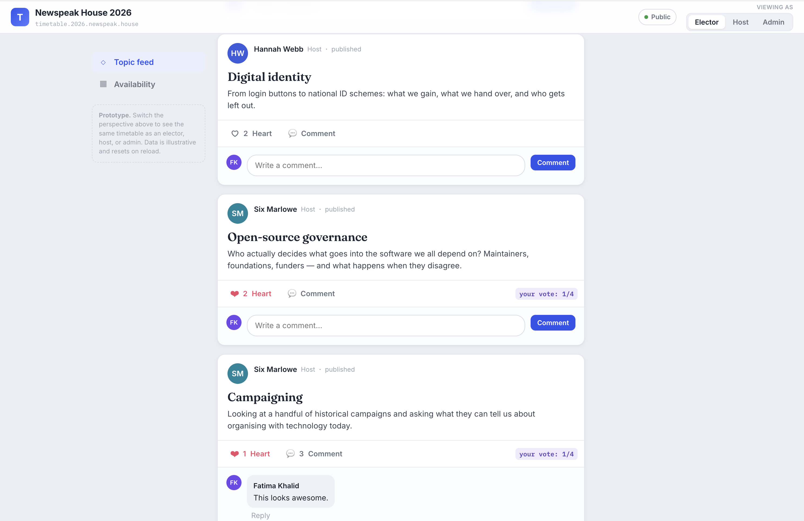
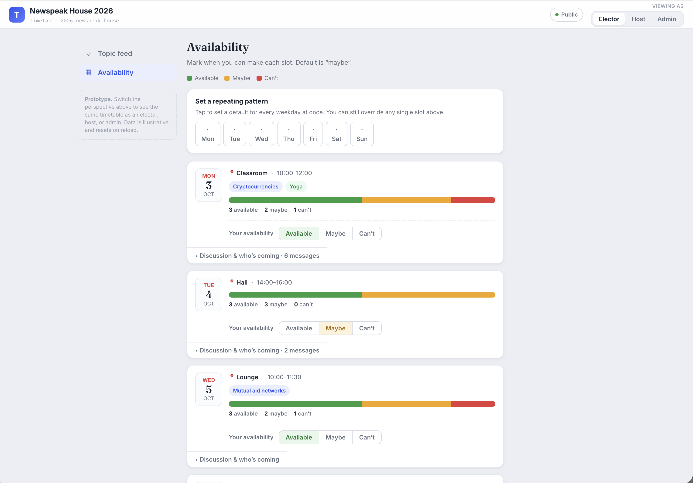

# Topic

[Topic](https://topic.forum) helps a community decide what it wants to talk
about — and when. Hosts propose topics they could run a session on; electors
signal what they want with weighted ❤️s; everyone shares their availability;
and the forum turns the most-wanted topics into a schedule of sessions.

A [Newspeak House](https://newspeak.house/) x
[Sparkle Bureaucracy](https://www.sparklebureaucracy.org/) production.





## What It Does

Topic is a multi-tenant web app: each forum is an independent workspace with
its own members, roles, topics, theme, and settings. The heart of the product
is a decision loop:

- **Propose.** Hosts draft topics in a rich-text editor and submit them;
  admins review and publish (or the forum lets hosts publish directly), with
  pre-publish feedback in a private drafting thread.
- **Vote.** Electors ❤️ the topics they want. Votes are weighted — someone
  who ❤️s everything counts for less per ❤️ than someone who chooses
  carefully — and hosts and admins see scores under four different
  normalisations, from raw totals to one-vote-each.
- **Discuss.** Threaded public comments, an optional host-only thread, and
  @mentions with in-app notifications and email digests.
- **Schedule.** Admins define a weekly pattern and term dates; slots are
  generated from the cross product. Electors mark availability once as a
  weekly pattern (with per-slot overrides), and hosts use per-topic
  availability lenses to find, claim, and confirm slots for sessions —
  which members can subscribe to as an ICS calendar feed.

Around the loop: five visibility levels from fully public to deactivated,
per-forum theming (colours, fonts, dark palette, custom role labels), a
People page with markdown bios and per-forum person pages, stable topic
permalinks, an activity timeline, analytics tables, and an admin add-person
flow that pre-creates accounts so a new member's first sign-in lands in a
ready-made profile.

[docs/PRODUCT.md](docs/PRODUCT.md) is the full product tour.

**A note on names:** the product was built as "Timetable", and code
identifiers — packages, database tables, internal routes — keep that name.
A "timetable" in code is a **forum** in the UI. See
[docs/ARCHITECTURE.md](docs/ARCHITECTURE.md) for where the boundary sits.

## Quick Start

Prerequisites:

- Node.js 20 or newer
- Docker, or another PostgreSQL 16 instance
- Clerk application keys for authentication

```bash
npm install

cp .env.example .env
cp .env.example apps/web/.env.local

npm run db:up
npm run db:migrate
npm run db:seed
# Optional, after setting real Clerk development keys in .env:
npm run clerk:seed-dev-users
npm run dev
```

Local URLs:

- Web: `http://localhost:3000`
- API: `http://localhost:4000`
- GraphQL: `http://localhost:4000/graphql`

`npm run db:seed` builds a fully populated sample forum from
`dev-sample-data.md`, including deterministic local dev users. To sign in as
one of them, run `npm run clerk:seed-dev-users` (against a Clerk
*development* instance — the script refuses production keys) and use the OTP
code `424242` with any `+clerk_test` email. Seeding details, including how
to map a sample person to a real Clerk account, are in
[docs/DEPLOYMENT.md](docs/DEPLOYMENT.md#github-actions).

## Docs

- [Product](docs/PRODUCT.md): what the product does, for whom, and its
  current status and gaps.
- [Architecture](docs/ARCHITECTURE.md): apps, packages, API surfaces, auth
  flow, data model, and runtime boundaries.
- [Deployment](docs/DEPLOYMENT.md): local/dev/prod environments, Clerk,
  DigitalOcean, GitHub Actions, secrets, and cron.
- [docs/execution-journal](docs/execution-journal/): one entry per notable
  change — the project's history lives there, not in the docs above.
- [CLAUDE.md](CLAUDE.md): working instructions for AI coding agents.

## Scripts

| Command | Description |
| --- | --- |
| `npm run dev` | Run API and web together |
| `npm run dev:api` / `npm run dev:web` | Run one app |
| `npm run typecheck` | Type-check every workspace |
| `npm run test` | Run unit tests |
| `npm run test:e2e` | Run Playwright anonymous browser smoke tests |
| `npm run lint` | Lint every workspace (web's own Next config, then `lint:node`) |
| `npm run lint:node` | Lint `apps/api`, `packages/*`, `tests`, and `scripts` with the root `eslint.config.mjs` |
| `npm run format` / `npm run format:check` | Prettier write / check (defaults; YAML and Markdown are exempt) |
| `npm run build` | Build all workspaces |
| `npm run db:generate` | Generate a SQL migration from the schema |
| `npm run db:migrate` | Apply migrations |
| `npm run db:seed` | Seed the local dev database from `dev-sample-data.md` |
| `npm run clerk:seed-dev-users` | Create/update Clerk dev users for the sample people |
| `npm run db:studio` | Open Drizzle Studio |
| `npm run db:up` / `npm run db:down` | Start or stop local Postgres |

## Testing

Pull requests must keep the full verification path green (CI enforces it):

```bash
npm run build && npm run typecheck && npm run lint && \
npm run format:check && npm run test && npm run test:e2e
```

plus `npm run db:migrate` when schema or migrations change. Tests are Vitest
(`packages/shared`, `apps/api`, `apps/web`) and one Playwright smoke suite
(`tests/e2e/`); the e2e suite always starts its own web server on port 3100
(override with `PLAYWRIGHT_PORT`), so it runs alongside a dev stack holding
:3000. Known coverage gaps are listed in
[docs/PRODUCT.md](docs/PRODUCT.md#testing-gaps).
