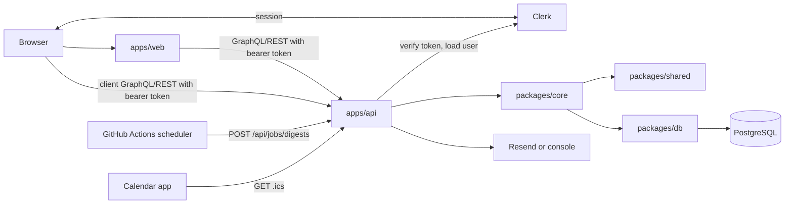

# Architecture

Timetable is a TypeScript npm-workspaces monorepo with a Next.js web app, an
Express/GraphQL API, shared domain services, and a PostgreSQL database managed
through Drizzle.

## Repository Shape

```txt
apps/
  web/    Next.js App Router UI, Clerk auth, server and client API calls
  api/    Express, GraphQL Yoga, REST jobs/integrations, Clerk token verification
packages/
  db/     Drizzle schema, client, migrations
  core/   Domain and service layer used by API routes
  shared/ Pure roles, permissions, validation, slug, and weighted-heart logic
```

## Stack

| Concern | Choice |
| --- | --- |
| Web | Next.js 16 App Router, React 19 |
| Auth | Clerk on web and API |
| API | Express 5, GraphQL Yoga, Pothos |
| Database | PostgreSQL 16, Drizzle ORM, drizzle-kit migrations |
| Markdown | markdown-it and sanitize-html on the API |
| Email | Resend when configured, console fallback in development |
| Hosting | DigitalOcean App Platform and Managed PostgreSQL |
| Tooling | TypeScript, ESLint, Vitest, Docker |

## Runtime Boundaries



The product runtime has no autonomous agents or AI orchestration. Build-time
Codex/agent workflows are separate from the app runtime.

## Web App

`apps/web` renders:

- public landing page
- Clerk sign-in and sign-up routes
- signed-in app shell
- timetable list and switcher
- topic feed
- host topic dashboard
- moderation queue
- activity timeline
- settings
- user profile
- availability calendar
- analytics dashboard

Server components call GraphQL through `apps/web/src/lib/graphql.ts`.
Client components call GraphQL through `apps/web/src/lib/clientGraphql.ts` and
REST through `apps/web/src/lib/clientApi.ts`.

## API App

`apps/api` owns request handling and auth boundary:

- GraphQL Yoga at `/graphql`
- REST under `/api`
- health check at `/health`
- Clerk token verification
- local user upsert on first API request
- digest rendering/sending
- ICS generation
- markdown rendering/sanitization
- request logging
- structured REST/Yoga error logging
- process-local rate limiting
- GraphQL depth and cost limiting

REST routes currently include:

| Route | Purpose |
| --- | --- |
| `POST /api/timetables` | Create a timetable; creator becomes owner and admin |
| `POST /api/timetables/:id/invites` | Invite emails and assign timetable roles |
| `PATCH /api/memberships/:id/roles` | Change member roles |
| `POST /api/jobs/digests` | Cron-protected digest job |
| `GET /api/timetables/:idOrSlug/calendar.ics` | Calendar feed |
| `GET /health` | Health check |

Object-storage env placeholders exist, but the tracked API currently has no
committed binary upload endpoint.

## GraphQL Surface

Main queries include:

- `me`
- `myTimetables`
- `timetable`
- `myMembership`
- `timetableMembers`
- `topicFeed`
- `hostDashboard`
- `moderationQueue`
- `activityTimeline`
- `timetableHosts`
- `calendar`
- `slotComments`
- `dashboard`
- `myIcsToken`
- `timetableRouteByDomain`
- `timetableByDomain`

Main mutations cover:

- topic creation, editing, submission, moderation, unpublishing
- heart toggling
- public and host-only comments
- comment hiding
- profile and notification settings
- timetable profile and settings
- slot creation, weekly repeat creation, editing, deletion
- availability and weekday availability
- slot comments
- slot topic tagging

The web proxy uses `timetableRouteByDomain` to rewrite custom-domain requests
onto the existing `/t/[slug]` route tree.

## Auth Flow

Clerk owns identity and session state. Timetable stores authorization and domain
data in PostgreSQL.

1. Browser authenticates with Clerk.
2. Web server/client sends a Clerk session token to the API.
3. API verifies the token with `@clerk/backend`.
4. API creates a local `user` row on first sign-in using the Clerk user id.
5. Pending email invites are claimed by matching the user's email.
6. Domain services load timetable memberships and enforce role permissions.

There are no Auth.js tables and no Clerk webhook is required for normal
operation. A future `user.deleted` webhook could be added if hard deletion of
local rows is required.

## Data Model

Core tables:

- `user`
- `timetables`
- `timetable_memberships`
- `timetable_invites`
- `topics`
- `hearts`
- `comments`
- `activity_events`
- `timeslots`
- `availability`
- `slot_comments`
- `slot_topics`

Migrations live in `packages/db/drizzle`.

## Assets

Static README images live in `docs/assets/readme`.

Web assets live in `apps/web/public/assets`. Next.js serves them from the site
root. The current logo path is:

```txt
/assets/timetable.love-logo-transparent.png
```

## Architecture Risks

- GraphQL has a depth limit, but no cost model yet.
- API rate limiting is process-local and should move to infrastructure for
  horizontally scaled production.
- Production env validation exists for core API variables but is not exhaustive.
- Topic and slot mutations check `deactivated` privacy; future mutations need
  the same review.
- Activity logging is not comprehensive across all user actions.
- Weighted feed and dashboard queries may need batching/materialization at scale.
