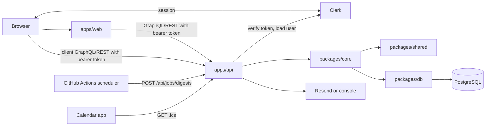

# Architecture

Timetable is a TypeScript npm-workspaces monorepo with a Next.js web app, an
Express/GraphQL API, shared domain services, and a PostgreSQL database managed
through Drizzle.

Since the 2026-07 rebrand the product is branded **Topic** (future domain
topic.forum) and the tenant entity is a "forum" in all user-facing copy. Code
identifiers, the `@timetable/*` package names, routes (`/t/`, `/timetables`),
CSS classes, and the GraphQL schema deliberately keep `timetable` naming — new
user-visible strings must say forum/Topic, and this document uses the code
names. The domain cutover (still timetable.love) happens separately.

## Repository Shape

```txt
apps/
  web/    Next.js App Router UI, Clerk auth, server and client API calls
  api/    Express, GraphQL Yoga, REST jobs/integrations, Clerk token verification
packages/
  db/     Drizzle schema, client, migrations
  core/   Domain and service layer used by API routes
  shared/ Pure roles, permissions, validation, slug, and weighted-heart logic
```

## Stack

| Concern | Choice |
| --- | --- |
| Web | Next.js 16 App Router, React 19 |
| Auth | Clerk on web and API |
| API | Express 5, GraphQL Yoga, Pothos |
| Database | PostgreSQL 16, Drizzle ORM, drizzle-kit migrations |
| Markdown | markdown-it and sanitize-html on the API; TipTap (tiptap-markdown) editor on the web |
| Email | Resend when configured, console fallback in development |
| Hosting | DigitalOcean App Platform and Managed PostgreSQL |
| Tooling | TypeScript, ESLint, Prettier, Vitest, Playwright, Docker |

Formatting is Prettier with default options (YAML and Markdown are exempt —
deploy specs are sed-templated); `npm run format:check` is a CI gate and the
baseline reformat commit is listed in `.git-blame-ignore-revs`. Linting covers
every workspace: `apps/web` uses its own Next.js flat config, and the root
`eslint.config.mjs` lints `apps/api`, `packages/*`, `tests/`, and `scripts/`
(`npm run lint` runs both).

## Runtime Boundaries



The product runtime has no autonomous agents or AI orchestration. Build-time
Codex/agent workflows are separate from the app runtime.

## Web App

`apps/web` renders:

- minimal public landing page (📚 brand mark + sign-in/sign-up links)
- Clerk sign-in and sign-up routes
- signed-in app shell: topbar with the current timetable's identity and a
  per-user light/dark toggle; left sidebar — a slide-in drawer on mobile —
  with section nav, a "Report a bug" link, and the timetable switcher (with
  visibility pills) in its footer
- topic feed with infinite scroll, sort controls (the four heart
  normalisations, latest comments, newest-including-edits, seeded random),
  host filter with profile card, and "new since last visit" highlights;
  hosts/admins get a sortable per-elector breakdown table (the shared
  `BreakdownTable` component: L1/L2/devotion weights + hearted-at, footer
  sums matching the topic's scores, names opening profile cards)
- topic permalinks at `/t/[slug]/[hostSlug]/[topicSlug]` (stale host segments
  redirect)
- My Topics (feed-identical cards + manage controls, TipTap editor; admins
  can create a topic on behalf of another host)
- Pending Topics (the submitted moderation queue; the draft topic status was
  removed — new topics are created as `submitted`)
- activity timeline (week/day grouping, date range, actor/role/type filters)
- notifications pane (comments on your topics, replies to you, unread badge)
- People page (role-grouped members, bios, admin editing; admins get an
  add-person card plus per-member invite state and a View as → Send invite →
  Edit profile action stack)
- settings (timetable profile + theme sections, hearts cutoff, invites)
- user profile (name, avatar, markdown bio, digest preferences)
- availability calendar (route live; nav link removed pending #55)
- analytics dashboard
- `/timetables` resolver → last-engaged timetable's feed, or the create screen

Per-timetable theme (colours, fonts, dark palette) is validated server-side,
stored in the settings JSON, and applied through a server-rendered style tag;
the user's light/dark choice is applied pre-paint from localStorage.

All web data access goes through one deep module,
`apps/web/src/lib/transport.ts`, which owns URL resolution, auth headers, and
GraphQL error handling behind a `TransportAuth` seam with server
(`transport.server.ts`, Clerk session token) and client
(`transport.client.ts`) adapters. Callers use four thin wrappers —
`gqlFetch` (`lib/graphql.ts`) and `apiFetch` (`lib/restClient.ts`) on the
server, `clientGql` (`lib/clientGraphql.ts`) and `clientApi`
(`lib/clientApi.ts`) in the browser — never hand-rolled `fetch`. Reads are
GraphQL; membership/invite/timetable writes plus uploads/cron/ICS are REST,
and that split is intentional.

Feed-page view-model derivation is centralised in `apps/web/src/lib/feedPage.ts`:
`topicPerms` computes a topic card's permission flags from the viewer's roles
and the topic status in one place, and `topicCardProps` assembles the shared
`TopicCard` props for every feed-like page.

## API App

`apps/api` owns request handling and auth boundary:

- GraphQL Yoga at `/graphql`
- REST under `/api`
- health check at `/health`
- Clerk token verification
- local user upsert on first API request
- digest rendering/sending
- ICS generation
- markdown rendering/sanitization
- request logging
- structured REST/Yoga error logging
- store-backed rate limiting, with shared PostgreSQL buckets in hosted apps
- GraphQL depth and cost limiting

REST routes currently include:

| Route | Purpose |
| --- | --- |
| `POST /api/timetables` | Create a timetable; creator becomes owner and admin |
| `POST /api/timetables/:id/invites` | Invite emails and assign timetable roles |
| `POST /api/timetables/:id/people` | Admin add-person: silently create the Clerk user + local row + membership in one call, no email |
| `POST /api/memberships/:id/invite` | Admin send (or resend) the invite email via Resend; records `inviteSentAt` |
| `PATCH /api/memberships/:id/roles` | Change member roles |
| `DELETE /api/memberships/:id` | Remove a member (the owner can never be removed) |
| `POST /api/jobs/digests` | Cron-protected digest job |
| `GET /api/timetables/:idOrSlug/calendar.ics` | Calendar feed |
| `POST /api/uploads` | Signed direct browser uploads to S3-compatible storage |
| `GET /health` | Health check |

The add-person flow deliberately splits account creation from the invite
email: `getOrCreateClerkUser` (`auth/clerk.ts`) finds or silently creates the
Clerk account (Clerk sends nothing), admins populate the profile and topics,
and the invite email is an explicit second step. `inviteSentAt` on
`timetable_memberships` (migration 0017) is null until it is sent.

## GraphQL Surface

Main queries include:

- `me`
- `myTimetables`
- `timetable`
- `myMembership`
- `timetableMembers`
- `timetablePeople` / `person` (People page and bio modal, with published
  topics per person)
- `topicFeed` (sort + seed + host + hearted-by-me filters, offset paging)
- `topicPermalink`
- `hostDashboard`
- `moderationQueue` (submitted topics; the draft topic status was removed)
- `activityTimeline` (actor, date-range args)
- `notifications` / `notificationsUnread`
- `myFeedLastSeenAt`
- `timetableHosts`
- `calendar`
- `slotComments`
- `dashboard`
- `myIcsToken`
- `timetableRouteByDomain`
- `timetableByDomain`

The `dashboard` query accepts optional host and elector-activity filters for
host/admin planning views.

`Member` exposes `inviteSentAt` so the People page can show per-member invite
state.

Main mutations cover:

- topic creation (hosts and admins; `createTopic` takes an admin-only
  `hostId` to create on behalf of another host, logged as `topic.reassign`),
  editing, submission, moderation, unpublishing, and owner reassignment
  (`reassignTopic`)
- heart toggling and the timetable hearts cutoff (`setHeartsCountFrom`)
- public and host-only comments
- comment hiding
- profile and notification settings; admin member-bio editing
  (`updateMemberBio`)
- timetable profile and settings, including validated theme JSON
- feed and notification watermarks (`markFeedSeen`, `markNotificationsSeen`)
- slot creation, weekly repeat creation, editing, deletion
- availability and weekday availability
- slot comments
- slot topic tagging

Hearts, comments, invites, and first sign-ins are logged as activity events
alongside moderation and lifecycle actions.

The web proxy uses `timetableRouteByDomain` to rewrite custom-domain requests
onto the existing `/t/[slug]` route tree.

## Auth Flow

Clerk owns identity and session state. Timetable stores authorization and domain
data in PostgreSQL.

1. Browser authenticates with Clerk.
2. Web server/client sends a Clerk session token to the API.
3. API verifies the token with `@clerk/backend`.
4. API creates a local `user` row on first sign-in using the Clerk user id.
5. Pending email invites are claimed by matching the user's email.
6. Domain services load timetable memberships and enforce role permissions.

There are no Auth.js tables and no Clerk webhook is required for normal
operation. A future `user.deleted` webhook could be added if hard deletion of
local rows is required.

## Data Model

Core tables:

- `user`
- `timetables`
- `timetable_memberships`
- `timetable_invites`
- `topics`
- `hearts`
- `comments`
- `activity_events`
- `timeslots`
- `availability`
- `slot_comments`
- `slot_topics`
- `api_rate_limit_buckets`

Notable columns: `timetables.settings` is a JSON blob holding role labels,
theme (colours, fonts, dark palette), icon/cover URLs, and digest defaults;
`timetables.heartsCountFrom` is the heart-count cutoff; `topics.slug` +
`users.slug` power permalinks; `topics.contentUpdatedAt` tracks content edits
for "newest" sorting; memberships carry `lastSeenFeedAt` and
`lastSeenNotificationsAt` watermarks plus `inviteSentAt` (null = added by an
admin but never invited).

The settings JSON shapes (`TimetableSettings`, `ThemeSettings`, role labels,
notification defaults) live in `packages/shared/src/settings.ts` as the single
source of truth: `packages/db` types its jsonb columns with them and the web
app parses/renders them from the same definitions. Types needed on both sides
of the HTTP boundary follow this pattern.

Migrations live in `packages/db/drizzle`.

## Deploy Topology

Merging to `main` auto-deploys dev (dev.timetable.love) when CI is green: the
workflow builds the web Docker image, pushes it to the DigitalOcean container
registry (`timetable-reg`), and deploys from `.do/app.dev.yaml`. After each
deploy it prunes the registry to the newest 5 `web` tags and starts a garbage
collection (the 500 MiB Starter registry otherwise fills in weeks).
Production deploys are manual-only. Per-PR review apps were removed
(2026-07-22) — dev is where QA happens. Details in `docs/DEPLOYMENT.md`.

## Assets

Static README images live in `docs/assets/readme`.

Web assets live in `apps/web/public/assets`. Next.js serves them from the site
root. Since the rebrand the logo is the 📚 emoji rendered inline (topbar brand
and landing page); the old `timetable.love-logo-transparent.png` asset is
unreferenced and slated for deletion at the domain cutover, along with adding
a proper favicon.

## Architecture Risks

- GraphQL has depth and cost limits, but both should be tuned as public traffic
  grows.
- Hosted API rate limiting uses shared PostgreSQL buckets; a dedicated edge/WAF
  limit may still be needed for high-volume public traffic.
- Production env validation exists for core API variables but is not exhaustive.
- Topic and slot mutations check `deactivated` privacy; future mutations need
  the same review.
- Activity logging covers topic lifecycle, hearts, comments, invites, first
  sign-ins, and settings changes; new user actions should keep logging.
- Weighted feed and dashboard queries may need batching/materialization at
  scale; the 2026-07-22 simplify audit measured on the order of 120 DB queries
  to render the feed page for an admin (lazy breakdown loading, batched
  comments, and per-request memoisation are queued fixes).
- Feed sorting (including seeded random) happens in the service layer after
  loading the timetable's published topics; fine at current sizes, revisit for
  very large timetables.
