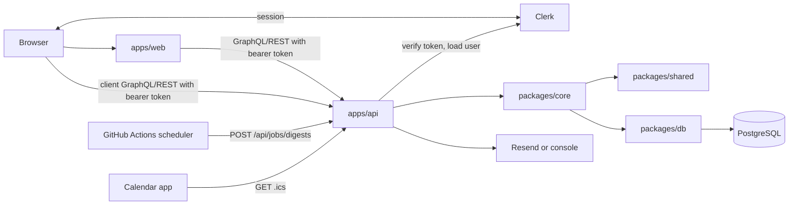

# Architecture

Topic is a TypeScript npm-workspaces monorepo with a Next.js web app, an
Express/GraphQL API, shared domain services, and a PostgreSQL database managed
through Drizzle.

**Naming:** the product was built as "Timetable" and later rebranded to
**Topic** (topic.forum), with the tenant entity called a **forum** in all
user-facing copy. The rename was applied outside-in and deliberately stopped
at the code boundary:

- **Say forum:** UI copy, the public API surface — GraphQL exposed names and
  `/api/forums/*` REST URLs — and web routes (`/f/[slug]`).
- **Say timetable:** code identifiers, `@timetable/*` package names, the
  `/timetables` resolver, CSS classes, and the DB schema.

New user-visible strings must say forum/Topic; this document otherwise uses
the code names.

## Repository Shape

```txt
apps/
  web/    Next.js App Router UI, Clerk auth, server and client API calls
  api/    Express, GraphQL Yoga, REST jobs/integrations, Clerk token verification
packages/
  db/     Drizzle schema, client, migrations
  core/   Domain and service layer used by API routes
  shared/ Pure roles, permissions, validation, slug, and weighted-heart logic
```

## Stack

| Concern | Choice |
| --- | --- |
| Web | Next.js 16 App Router, React 19 |
| Auth | Clerk on web and API |
| API | Express 5, GraphQL Yoga, Pothos |
| Database | PostgreSQL 16, Drizzle ORM, drizzle-kit migrations |
| Markdown | markdown-it and sanitize-html on the API; TipTap (tiptap-markdown) editor on the web |
| Email | Resend when configured, console fallback in development |
| Hosting | DigitalOcean App Platform and Managed PostgreSQL |
| Tooling | TypeScript, ESLint, Prettier, Vitest, Playwright, Docker |

Formatting is Prettier with default options (YAML and Markdown are exempt —
deploy specs are sed-templated); `npm run format:check` is a CI gate and the
baseline reformat commit is listed in `.git-blame-ignore-revs`. Linting covers
every workspace: `apps/web` uses its own Next.js flat config, and the root
`eslint.config.mjs` lints `apps/api`, `packages/*`, `tests/`, and `scripts/`
(`npm run lint` runs both).

## Runtime Boundaries


```mermaid
flowchart LR
  browser[Browser]
  clerk[Clerk]
  web[apps/web]
  api[apps/api]
  core[packages/core]
  shared[packages/shared]
  dbpkg[packages/db]
  pg[(PostgreSQL)]
  email[Resend or console]
  cron[GitHub Actions scheduler]
  cal[Calendar app]

  browser <-->|session| clerk
  browser --> web
  web -->|GraphQL/REST with bearer token| api
  browser -->|client GraphQL/REST with bearer token| api
  api -->|verify token, load user| clerk
  api --> core
  core --> shared
  core --> dbpkg --> pg
  api --> email
  cron -->|POST /api/jobs/digests| api
  cal -->|GET .ics| api
```

The product runtime has no autonomous agents or AI orchestration. Build-time
Codex/agent workflows are separate from the app runtime.

## Web App

`apps/web` renders:

- minimal public landing page (📚 brand mark + sign-in/sign-up links)
- Clerk sign-in and sign-up routes
- signed-in app shell: topbar with the current timetable's identity and a
  per-user light/dark toggle; left sidebar — a slide-in drawer on mobile —
  with section nav, a "Report a bug" link, and the timetable switcher (with
  visibility pills) in its footer
- topic feed with infinite scroll, sort controls (the four heart
  normalisations, latest comments, newest-including-edits, seeded random),
  host filter with profile card, and "new since last visit" highlights;
  electors also get the **Topic Queue** (`/f/[slug]/queue`, its own
  sidebar page with a red never-seen badge; old `?sort=queue` redirects):
  one unhearted topic at a time in a per-user stable shuffle with big
  🔁/❤️ decision buttons, round-based with an explicit restart
  (`packages/core/src/queue.ts`);
  hosts/admins get a sortable per-elector breakdown table (the shared
  `BreakdownTable` component: L1/L2/devotion weights + hearted-at, footer
  sums matching the topic's scores, names linking to person pages)
- topic permalinks at `/f/[slug]/[hostSlug]/[topicSlug]` (stale host segments
  redirect; old `/t/` URLs permanently redirect and must keep doing so)
- person pages at `/f/[slug]/[userSlug]` (per-forum member profiles; a
  userId segment canonically redirects to the member's slug)
- My Topics (feed-identical cards + manage controls, TipTap editor; admins
  can create a topic on behalf of another host; each card's sections —
  public comments / host-only / drafting / Scheduling — are one horizontal
  tab strip (`TopicCardTabs`, 2026-08-14); the Scheduling tab is the
  topic-workbench — a lazy per-topic mini-calendar: hearters' availability
  across future slots as washed rows (shared `CalendarRowWash` pieces,
  month headings + week gaps by date) with the avatar fold, a
  Date/Availability sort toggle, and pencil/unpencil per row)
- Pending Topics (the submitted moderation queue — new topics are created
  as `submitted`; there is no draft status)
- activity timeline (week/day grouping, date range, actor/role/type filters)
- notifications pane (comments on your topics, replies to you, unread badge)
- People page (role-grouped members, bios, admin editing; admins get an
  add-person card plus per-member invite state and a View as → Send invite →
  Edit profile action stack)
- settings (timetable profile + theme sections, hearts cutoff, invites)
- user profile (name, avatar, markdown bio; digest preferences live on
  each forum's Notifications page)
- Calendar (feature-flagged per forum via
  `settings.calendar.enabled` — nav link and page exist only when on):
  month-grouped slot rows with a topic lens, per-elector avatar groups
  (host/admin), elector weekly-pattern grid, admin pattern×terms setup with
  client-side slot generation, host off-piste proposals, session
  pencil/confirm controls, per-slot discussion threads open to every member
  (2026-08-14; claim comments with frozen availability snapshots stay a
  host/admin gesture, but everyone reads them)
- Analysis page (`/f/[slug]/analysis`): topics analysis table with ❤️ and 💬
  normalisations, per-table host filters, elector activity table with
  per-row topic folds, admin-only host activity table
- `/admin` sysadmin dashboard (SYSADMIN_EMAILS-gated forum overview/delete)
- `/timetables` resolver → last-engaged timetable's feed, or the create screen
- social preview (Open Graph) cards for the app, forums, topics, and people
  (`opengraph-image.tsx` per segment + `lib/ogCard.tsx`; resolved via a
  session-less GraphQL fetch so private content degrades to generic cards)

Per-timetable theme (colours, fonts, dark palette) is validated server-side,
stored in the settings JSON, and applied through a server-rendered style tag;
the user's light/dark choice is applied pre-paint from localStorage.

All web data access goes through one deep module,
`apps/web/src/lib/transport.ts`, which owns URL resolution, auth headers, and
GraphQL error handling behind a `TransportAuth` seam with server
(`transport.server.ts`, Clerk session token) and client
(`transport.client.ts`) adapters. Callers use four thin wrappers —
`gqlFetch` (`lib/graphql.ts`) and `apiFetch` (`lib/restClient.ts`) on the
server, `clientGql` (`lib/clientGraphql.ts`) and `clientApi`
(`lib/clientApi.ts`) in the browser — never hand-rolled `fetch`. Reads are
GraphQL; membership/invite/timetable writes plus uploads/cron/ICS are REST,
and that split is intentional.

Feed-page view-model derivation is centralised in `apps/web/src/lib/feedPage.ts`:
`topicPerms` computes a topic card's permission flags from the viewer's roles
and the topic status in one place, and `topicCardProps` assembles the shared
`TopicCard` props for every feed-like page.

## API App

`apps/api` owns request handling and auth boundary:

- GraphQL Yoga at `/graphql`
- REST under `/api`
- health check at `/health`
- Clerk token verification
- personal API token verification (GraphQL only) and per-token mutation scopes
- local user upsert on first API request
- digest rendering/sending
- ICS generation
- markdown rendering/sanitization
- request logging
- structured REST/Yoga error logging
- store-backed rate limiting, with shared PostgreSQL buckets in hosted apps
- GraphQL depth and cost limiting

REST routes currently include:

| Route | Purpose |
| --- | --- |
| `POST /api/forums` | Create a timetable; creator becomes owner and admin |
| `POST /api/forums/:id/invites` | Invite emails and assign timetable roles |
| `POST /api/forums/:id/people` | Admin add-person: silently create the Clerk user + local row + membership in one call, no email |
| `POST /api/memberships/:id/invite` | Admin send (or resend) the invite email via Resend; records `inviteSentAt` |
| `PATCH /api/memberships/:id/roles` | Change member roles |
| `DELETE /api/memberships/:id` | Remove a member (the owner can never be removed) |
| `POST /api/jobs/digests` | Cron-protected digest job |
| `GET /api/forums/:idOrSlug/calendar.ics` | Calendar feed |
| `GET /api/forums/:idOrSlug/feed.atom` | Atom feed of the newest published topics (anonymous-only — private forums 404) |
| `GET /api/forums/:idOrSlug/export` | Read-only JSON export of a forum's public data |
| `DELETE /api/forums/:id` | Delete a forum (sysadmin dashboard) |
| `POST /api/uploads` | Signed direct browser uploads to S3-compatible storage |
| `GET /health` | Health check |

Legacy `/api/timetables/:idOrSlug/{calendar.ics,feed.atom}` URLs 301-redirect
to the `/api/forums` equivalents (query string preserved — ICS tokens live in
members' calendar apps). Never remove.

The add-person flow deliberately splits account creation from the invite
email: `getOrCreateClerkUser` (`auth/clerk.ts`) finds or silently creates the
Clerk account (Clerk sends nothing), admins populate the profile and topics,
and the invite email is an explicit second step. `inviteSentAt` on
`timetable_memberships` (migration 0017) is null until it is sent.

## GraphQL Surface

The public surface uses **forum** naming; the web app's own
queries alias the fields back to internal `timetable` names
(`timetable: forum(idOrSlug: $s)`), so TypeScript identifiers stay unchanged.

Main queries include:

- `me`
- `myForums`
- `forum`
- `myMembership`
- `forumMembers`
- `forumPeople` / `person` (People page and person pages, with published
  topics per person)
- `topicFeed` (sort + seed + host + hearted-by-me filters, offset paging)
- `topicPermalink`
- `hostDashboard`
- `moderationQueue` (submitted topics)
- `activityTimeline` (actor, date-range args)
- `notifications` / `notificationsUnread`
- `myFeedLastSeenAt`
- `forumHosts`
- `calendar` (audience lens + `includePast`; per-elector rows host/admin-only)
- `slotComments`
- `topicSlotFit` (topic-workbench: one topic's hearters vs future slots)
- `myAvailabilityPattern`
- `dashboard`
- `myIcsToken`
- `timetableRouteByDomain`
- `forumByDomain`

The `dashboard` query accepts optional host and elector-activity filters for
host/admin planning views.

`Member` exposes `inviteSentAt` so the People page can show per-member invite
state.

Main mutations cover:

- topic creation (hosts and admins; `createTopic` takes an admin-only
  `hostId` to create on behalf of another host, logged as `topic.reassign`),
  editing, submission, moderation, unpublishing, and owner reassignment
  (`reassignTopic`)
- heart toggling and the timetable hearts cutoff (`setHeartsCountFrom`);
  host 💙 toggling (`hostHeartTopic`, host-non-electors only — tallies and
  the per-topic host breakdown are admin-only, attribution rides the
  host-only thread)
- public and host-only comments (the host-only thread is a forum option,
  `settings.hostComments.enabled`, default on)
- comment hiding
- profile and notification settings; admin member-bio editing
  (`updateMemberBio`)
- timetable profile and settings, including validated theme JSON
- seen watermarks: feed and notifications (`markFeedSeen`,
  `markNotificationsSeen`), per-topic comments-seen on engagement
  (`markCommentsSeen`), and digest click-to-read (`markDigestRead`)
- slot bulk creation (`createTimeslots`, idempotent pattern×terms
  generation and one-off dates; returns `{created, augmented}` — augmented
  counts existing slots that gained locations), host off-piste proposals
  (`proposeSlot`), editing (incl. `locationsJson`), deletion
- per-slot availability (`setAvailability`) and the weekly template
  (`setMyAvailabilityPattern`); effective state resolves explicit → pattern
  cell (via the slot's `cellKey`) → yellow
- slot comments, optionally as session claims (`topicId` + a
  server-computed, frozen 🟢🟡🔴 snapshot of that topic's hearters), with
  author edit/delete and admin hide (`updateSlotComment`,
  `deleteSlotComment`, `hideSlotComment`)
- the session lifecycle (`addSlotSession`: a topic, an office-hours
  `sessionHostId`, or an admin-only custom `title` — always location-less;
  `updateSlotSession` for confirm/URL/location — the room is assigned at
  confirm time, and confirmed sessions are exclusive per (slot, location);
  `clearSlotSession`), gated by the forum's confirm policy and the
  never-displace rule per booking (`canTouchSlotSession` against
  `session_host_id`; custom sessions gate on the admin bit). Any number of
  pencils can share a slot; only confirmed rooms contend. Calendar actions
  are activity-logged and session events notify the topic's hearters
- topic publishing by the owning host when
  `settings.topics.hostsPublishDirectly` is on (same `moderateTopic`
  mutation; admin review becomes post-hoc)

Hearts, comments, invites, and first sign-ins are logged as activity events
alongside moderation and lifecycle actions.

The web proxy uses `timetableRouteByDomain` to rewrite custom-domain requests
onto the existing `/f/[slug]` route tree.

## Auth Flow

Clerk owns identity and session state. Timetable stores authorization and domain
data in PostgreSQL.

1. Browser authenticates with Clerk.
2. Web server/client sends a Clerk session token to the API.
3. API verifies the token with `@clerk/backend`.
4. API creates a local `user` row on first sign-in using the Clerk user id.
5. Pending email invites are claimed by matching the user's email.
6. Domain services load timetable memberships and enforce role permissions.

There are no Auth.js tables and no Clerk webhook is required for normal
operation. A future `user.deleted` webhook could be added if hard deletion of
local rows is required.

### Personal API tokens (2026-08-13)

A second credential, for scripts and external clients that can't hold a
60-second Clerk session token. `buildContext` resolves either one:

1. A `Bearer tpk_…` value is looked up by its SHA-256 in `api_token` (only the
   hash is stored) and resolves to its owner plus the token's scopes; anything
   else goes to the Clerk path above.
2. `apps/api/src/graphql/token-scopes.ts` gates mutations by those scopes in one
   `onExecute` plugin, **default-deny**: a mutation it doesn't map is
   unreachable by any token, which is what keeps moderation, forum settings,
   member management, and token administration session-only regardless of the
   owner's roles. The resolvers' own role checks still run on top.
3. Scope enforcement is GraphQL-only, so **REST must not accept these tokens**:
   `buildContext` takes `allowApiToken` and only the Yoga context passes true.
   See the flag's own docs — this is enforced by construction, not convention.

Tokens are account-wide and carry no impersonation (`x-view-as` is ignored).
Rate limiting is two-layer (2026-08-14 hardening): the pre-auth middleware
buckets strictly by client IP — bucketing by the presented token would let
unvalidated `tpk_` strings mint a fresh bucket per request — and a token is
charged its own request budget only after its hash lookup succeeds
(`auth/api-token.ts`), plus per-token write budgets — hourly burst and daily
volume caps per action class (`TOKEN_WRITE_LIMITS` in
`graphql/token-scopes.ts`). Minting is capped
(10/hour, 25 active per user) and an omitted expiry defaults to 90 days
server-side; "never expires" needs an explicit null.

## Data Model

Core tables:

- `user`
- `timetables`
- `timetable_slug_history` (editable slugs, 2026-08-10: every slug a forum
  has ever had, globally reserved so old links can never be hijacked;
  resolves via the `getReadableTimetable` fallback and 308-redirects via
  the web proxy; a forum reclaiming its own old slug deletes the row)
- `timetable_memberships`
- `timetable_invites`
- `topics`
- `hearts`
- `host_hearts` (host 💙s: the host-non-elector parallel gesture, mirrored
  from `hearts` in its own table so elector weighting never sees it;
  ignores `heartsCountFrom`)
- `heart_events` (append-only ❤️/💙 add/remove ledger — never updated or
  deleted by the app, unaffected by the cutoff; lets voting history be
  reconstructed across un-hearts and cutoff resets. Written by both
  toggles, read only by the admin data export)
- `comments`
- `comment_mentions` (@mention rows, written only for members allowed to
  see the thread)
- `topic_seen` (per-user queue-exposure record: queue Next or hearting;
  suppresses new-topic digest cards)
- `comment_seen` (per-user-per-topic comments-seen watermark, 2026-08-13:
  bumped only on engagement — teaser expand, permalink visit, digest
  click — drives the teaser's "new" previews and comment digest
  suppression)
- `digest_sends` (one row per digest email sent: which topics' cards
  showed comment threads; every link in that email carries `dg=<id>`, so
  any click marks the digest read. Doubles as a send log)
- `activity_events`
- `timeslots` (bookings model, 2026-08-06: a pure TIME WINDOW, unique per
  forum+start+end; `created_by_id`, `cell_key` — the pattern-cell
  provenance for inference. Availability and discussion attach here
  because both are about the time. `locations` (2026-08-11): the set of
  locations offered at this time, chosen at creation — same-time creation
  AGGREGATES locations into the existing slot (`planSlotCreation` in
  shared), and the calendar's location filter matches this set; empty =
  legacy/location-free forum)
- `slot_sessions` (bookings, zero-to-many per slot; pencils are
  location-less time-intents since 2026-08-14 — unique per slot+topic,
  plus one office-hours pencil per slot+host; `location` is assigned at
  confirm time, and a partial unique index makes confirmed sessions
  exclusive per slot+non-empty location. A singular `topic_id` OR
  `session_host_id` (THE ownership column:
  the topic's host, or the host themselves for topic-less "office hours")
  OR an admin-only `custom_title`; `status` `proposed`/`confirmed` + `url`
  — an empty slot simply has no rows)
- `availability` (explicit per-slot answers — location-independent)
- `availability_patterns` (one row per forum+user; jsonb cell → state map)
- `slot_comments` (+ optional claim: `topic_id` and frozen
  green/yellow/red counts; + `edited_at`/`hidden_at`/`hidden_by_user_id`
  for author edits and admin moderation)
- `api_rate_limit_buckets`

Notable columns: `timetables.settings` is a JSON blob holding role labels,
theme (colours, fonts, dark palette), icon/cover URLs, digest defaults, the
calendar group (enabled flag, confirm policy, locations, pattern cells,
terms), the topics policy (`hostsPublishDirectly`), and the host-comments
option (`hostComments.enabled`, default on — hides the host-only thread and
💙 attribution when off);
`timetables.heartsCountFrom` is the heart-count cutoff; `topics.slug` +
`timetable_memberships.slug` power permalinks (member profiles are
per-forum); `topics.contentUpdatedAt` tracks content edits
for "newest" sorting; memberships carry `lastSeenFeedAt` and
`lastSeenNotificationsAt` watermarks, `inviteSentAt` (null = added by an
admin but never invited), the per-forum `digestSettings` JSON +
`lastDigestAt` send watermark (2026-08-11, falling back to the user-level
equivalents), and `queueRoundStartedAt`. A membership with `inviteSentAt`
null AND both seen-watermarks null is a pre-created account whose owner
doesn't know the forum exists — the digest builder skips those forums
entirely.

The settings JSON shapes (`TimetableSettings`, `ThemeSettings`, role labels,
notification defaults) live in `packages/shared/src/settings.ts` as the single
source of truth: `packages/db` types its jsonb columns with them and the web
app parses/renders them from the same definitions. Types needed on both sides
of the HTTP boundary follow this pattern.

Migrations live in `packages/db/drizzle`.

## Deploy Topology

Merging to `main` auto-deploys dev (dev.timetable.love) when CI is green: the
workflow builds the web Docker image, pushes it to the DigitalOcean container
registry (`timetable-reg`), and deploys from `.do/app.dev.yaml`. After each
deploy it prunes the registry to the newest 5 `web` tags and starts a garbage
collection (the 500 MiB Starter registry otherwise fills in weeks).
Production (topic.forum, with timetable.love as an alias) deploys manually
only. There are no per-PR review apps — dev is where QA happens. Details in
`docs/DEPLOYMENT.md`.

## Assets

Static README images live in `docs/assets/readme`. The app has no image
assets of its own: the logo is the 📚 emoji rendered inline (topbar brand
and landing page) and the favicon is an emoji data URI (`lib/favicon.ts` —
forums can override it with their own icon emoji). `apps/web/public/` is
kept (empty) so Next.js serves any future static files from the site root.

## Architecture Risks

- GraphQL has depth and cost limits, but both should be tuned as public traffic
  grows.
- Hosted API rate limiting uses shared PostgreSQL buckets; a dedicated edge/WAF
  limit may still be needed for high-volume public traffic.
- Production env validation exists for core API variables but is not exhaustive.
- Topic and slot mutations check `deactivated` privacy; future mutations need
  the same review.
- Activity logging covers topic lifecycle, hearts, comments, invites, first
  sign-ins, and settings changes; new user actions should keep logging.
- Weighted feed and dashboard queries may need batching/materialization at
  scale; the 2026-07-22 simplify audit measured on the order of 120 DB queries
  to render the feed page for an admin. Lazy breakdown loading, batched
  comment trees, and per-request memoisation have all since shipped.
- Feed sorting (including seeded random) happens in the service layer after
  loading the timetable's published topics; fine at current sizes, revisit for
  very large timetables.
